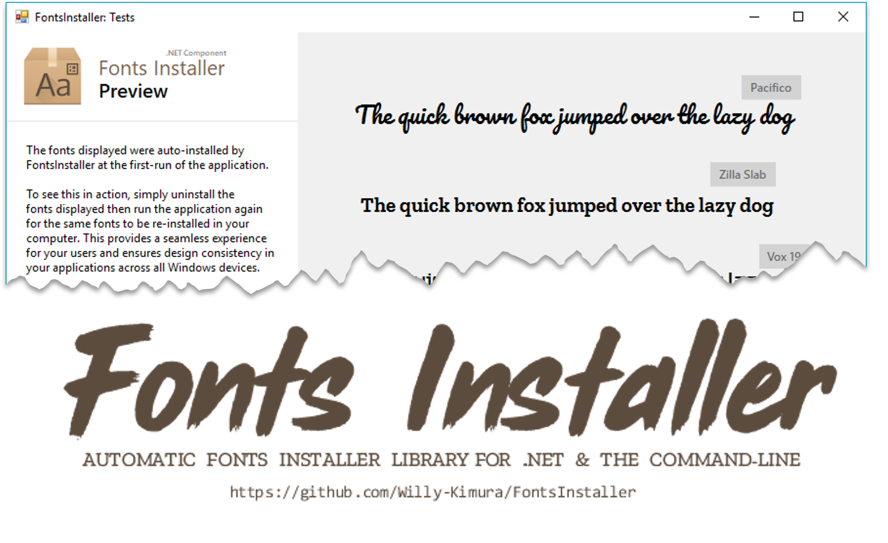
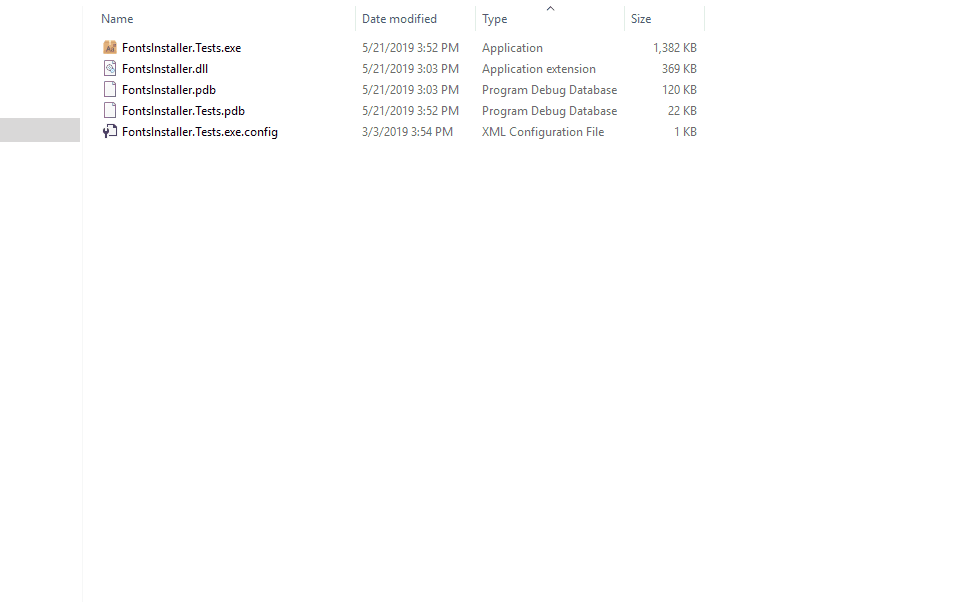
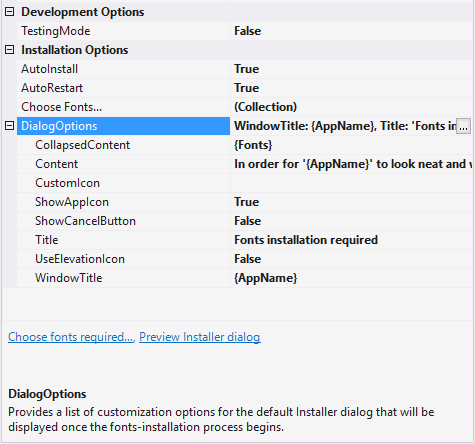
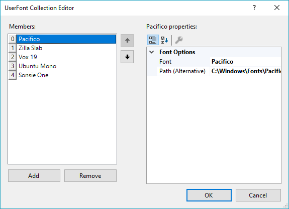
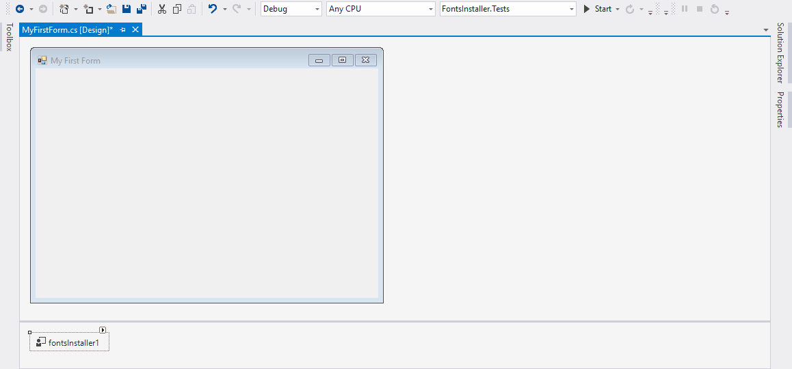
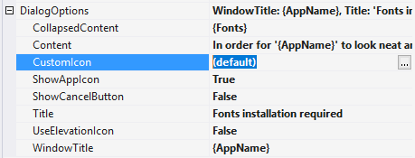
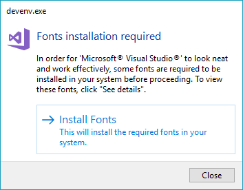
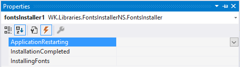
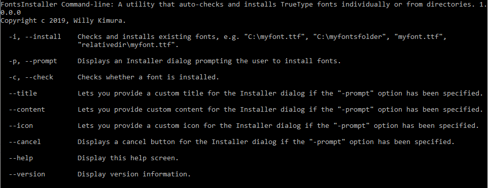

# FontsInstaller
[](https://www.nuget.org/packages/FontsInstaller/) [](https://www.paypal.com/cgi-bin/webscr?cmd=_s-xclick&hosted_button_id=DJ8D9CE8BWA3J&source=url)



**FontsInstaller** is a .NET library that lets developers choose the fonts required by their applications then at runtime auto-checks and installs them if not available on any client machine.

Below is a preview of the library in action:



# Installation
>If you previously downloaded or installed [this package](https://www.nuget.org/packages/FonstInstaller/) from NuGet, please consider using [this new package](https://www.nuget.org/packages/FontsInstaller/) in order to receive the latest updates once they're published. There was a small typo error that occurred when publishing the package, *Fon**st**Installer* rather than *Fon**ts**Installer*.

To install via the [NuGet Package Manager](https://www.nuget.org/packages/FontsInstaller/) Console, run:

> `Install-Package FontsInstaller`

To install the command-line utility via [NuGet](https://www.nuget.org/packages/FontsInstaller.Cmd/), run:

> `Install-Package FontsInstaller.Cmd`

You can also head over to the [Releases](https://github.com/Willy-Kimura/FontsInstaller/releases) section to download releases manually.

# Features
Here's a comprehensive list of the features available:

- Built as a component making it accessible in Design Mode.
- Supports [.NET Framework 4.0](https://www.microsoft.com/en-us/download/details.aspx?id=17718) and higher.
- Auto-installs all the fonts required by your application once specified.
- Portable .NET applications now won't need to be packaged with their required fonts once installed on any computer.
- Lets you choose the fonts required by your application either in Design Mode or programmatically. You can also monitor and/or intercept the entire fonts installation cycle using the events `InstallingFonts`, `InstallationCompleted`, and `ApplicationRestarting` which are included.
- Provides an easy-to-use and customizable Installer dialog. You can also opt to use your own customized Installer Dialog using a Windows Form.
- Also includes a *test-mode* feature that lets you have a sneak preview of how the Installer dialog will look like once you deploy your application to users. This is especially important when customizing the Installer dialog. The *test-mode* feature runs when running your application from Visual Studio - both in **Debug** and **Release** modes.
- Lets you programmatically install fonts collectively or individually within folders.
- Comes with a command-line utility **FontsInstaller.Cmd** (*to be discussed later) that does also check and install fonts if unavailable (either *silently* or via the default Installer dialog) and provides a number of installation and customization options. This could come in handy for portable non .NET applications requiring a number of fonts without the need to host them in an Installer package.

# Usage
### Working in Design Mode
If you prefer working with the Designer which is super easy, simply add the *FontsInstaller.dll* library to Visual Studio's Toolbox, then drag-and-drop it onto your Main Form.

You can then use the *Properties* window to change its options:



Selecting fonts has been made easy too using  the *Fonts Collection Editor* and a customized *Fonts Selection Dialog*. Here's a screenshot and a live-preview of both:

- The Fonts Collection Editor:




- Using the Fonts Collection Editor:




> Depending on the number of fonts you have installed, it may take sometime to load the *Fonts Selection Dialog* at first-run, but other subsequent load-times will be relatively faster, so no worries.

You can also get to see a live preview of the Installer Dialog simply by clicking the **Preview Installer Dialog** from the Smart Tags menu or the ellipsis (**...**) button located beside the `DialogOptions` property. Setting the `TestingMode` property to true will also preview the Installer Dialog when debugging your application from Visual Studio.

To note, once you provide an icon for your application, the Installer Dialog will use it when the dialog is displayed for purposes of credibility to users. This behaviour can be enabled or disabled by setting the `ShowCancelButton` to `true` or `false` respectively. Also, you can use the default icon that comes bundled with Fonts Installer by passing the string `(default)` in the `DialogOptions.CustomIcon` property:



If you'd wish to provide users with a **Close** button in the Installer Dialog (*which makes it optional to install the chosen fonts*), then you can set the property `DialogOptions.ShowCloseButton` to `true`. This however is not recommended for applications that require the chosen font(s).

Here's a preview of the Installer dialog with the **Close** button as displayed in Visual Studio:



You can modify the Installer dialog's content using the `DialogOptions.Content` property. Each string property within the `DialogOptions`property comes with a customized Multi-line String Editor and includes a number of usable string templates, namely:

>`{AppName}` : Represents the default application's name.
>
>`{AppVersion}`: Represents the default application's version.
>
>`{Fonts}`: Represents the list of user-fonts added.
>
>`{FontsCount}`: Represents the number of user-fonts added.
>
>`{InstallButtonText}`: Represents the text applied to the installation button.
>
>`{FontsRequiredExpression}`: Represents a statement auto-generated based on the number of fonts to be installed.
>
>`{FontsExpression}`: Represents the entire list of user-fonts added as viewed from the collapsed-content area of the Installer dialog.

These templates will then be expanded to their necessary values at compile-time.

So, for example, you can provide your own content in this format:

`You are required to install {FontsCount} fonts for {AppName} to work effectively. These fonts are:\n\n{Fonts}\n\nClick on {InstallButtonText} to continue...`

You can also use the `ParseString()` method to parse/convert any content containing the string templates. 
Here's an example:

`string content = fontsInstaller1.ParseString(myString);`

### Working programmatically

#### Adding & Installing Fonts

When installing fonts programmatically, please note that you'll need to provide a relative location for each font required by your application. This means that you'll provide the location of your font(s) in order for them to be added at runtime. The easiest way to do this is to include all the fonts within a folder relative to the location of your application's directory.

So, let's say you've included all the required fonts within a folder named *Fonts* located within your application's directory; to install them, first import `WK.Libraries.FontsInstallerNS` - the code samples below can then assist you:

```c#
var fontsInstaller = new FontsInstaller();
fontsInstaller.InstallFonts($@"{Application.StartupPath}\Fonts");
```

You can include the code above within your Form's constructor or in the Form's `Load` event:

```c#
private void MainForm_Load(object sender, EventArgs e)
{
    var fontsInstaller = new FontsInstaller();
	fontsInstaller.InstallFonts($@"{Application.StartupPath}\Fonts");
}
```

If you only need to install a single font, then the method `InstallFont()` should be enough:

```c#
fontsInstaller.InstallFont($@"{Application.StartupPath}\Fonts\Roboto.ttf");
```

Likewise, you can install fonts from the same or separate locations using a variant of the `InstallFonts()` method which accepts an array of font-files:

```c#
fontsInstaller.InstallFonts(new[] { 
    $@"{Application.StartupPath}\Fonts\Default\Roboto.ttf",
    $@"{Application.StartupPath}\Fonts\Editing\Raleway.ttf",
    $@"{Application.StartupPath}\Fonts\Styling\Pacifico.ttf"
});
```

If you prefer not displaying the Installer Dialog or rather perform a silent font installation, simply set the second parameter `showDialog` in either the `InstallFont()` or `InstallFonts()` methods to `false`:

```c#
fontsInstaller.InstallFont($@"{Application.StartupPath}\Roboto.ttf", false);
```

```c#
fontsInstaller.InstallFonts(new[] { 
    $@"{Application.StartupPath}\Fonts\Default\Roboto.ttf",
    $@"{Application.StartupPath}\Fonts\Editing\Raleway.ttf",
    $@"{Application.StartupPath}\Fonts\Styling\Pacifico.ttf"
}, false);
```

You can also use the `Fonts` property to add your list of required fonts, then call the `Install()` method :

```c#
// Ensure you import: WK.Libraries.FontsInstallerNS.Models.
fontsInstaller.Fonts.AddRange(new[] {
	new UserFont()
    {
    	ExtractFontName = false,
        Path = $@"{Application.StartupPath}\Roboto.ttf"
    },
    new UserFont()
    {
        ExtractFontName = false,
        Path = $@"{Application.StartupPath}\Raleway.ttf"
    }
});

// Install the fonts added.
fontsInstaller.Install();
```

The property `ExtractFontName` when set to `true` will display a font by its default family name rather than the filename. This however may not be necessary since it's used for display purposes only.

#### Preventing Automatic Installation

By default, Fonts Installer will automatically install fonts once the Form hosting the component is loaded. To manually prevent this behaviour, you can set the property `AutoInstall` to `false`. Once set, you can decide how, when, and where the fonts-installation process will take place:

```c#
fontsInstaller.AutoInstall = false;
```

By default however, this option is internally set since the library is able to determine when it's added from the Toolbox or through user-code.

#### Working with Events

To determine whether the installation process was successful, use the `InstallationCompleted` event's `InstallationSucceeded` argument property. You can also know whether the user cancelled the install operation using the `UserCancelled` property:

```c#
fontsInstaller.InstallationCompleted += (snd, args) =>
{
    // Did the user cancel the install process?
    // This is only necessary when the property
    // "DialogOptions.ShowCancelButton" is set to true.
    if (args.UserCancelled)
    {
        // Do something...
    }
    else if (!args.InstallationSucceeded)
    {
        // If installation failed (though very rare), 
        // inform the user. You may also direct them 
        // to install the fonts not installed manually.

        List<string> failedFonts = new List<string>();

        foreach (UserFont font in args.FontsNotInstalled)
            failedFonts.Add(font.Name);

        var result = MessageBox.Show(this,
            $"The following fonts failed to install...\n " +
            $"{string.Join(",\n", failedFonts)}",
            "Fonts Installation Issue",
            MessageBoxButtons.OK);
    }
};
```

Though under very rare circumstances would fonts fail to install, the `InstallationCompleted` event will help determine whether the entire process was successful and the fonts that failed to install. You can view the list of these fonts using the argument property `FontsNotInstalled`. Alternatively, to view the list of fonts installed, use the argument property `FontsInstalled`.

After the fonts-installation process has been completed, the library will restart your application in order for the font changes to be effected in all Forms. *Please note that this task is mandatory since fonts' resource initialization occurs whenever an application is loaded in memory*. This then means that once the installation task completes, a restart is invoked and the application restarted. You can however intercept this behaviour either by adding an `ApplicationRestarting` event or setting the `AutoRestart` property to `false`.

Here's an example using the event described to control the restart event:

```c#
fontsInstaller.ApplicationRestarting += delegate
{
    var result = MessageBox.Show(this, "Preparing to restart...\nClick 'OK'.", 
                                 "Finished fonts installation!", 
                                 MessageBoxButtons.OK);

    if (result == DialogResult.OK) 
    {
        Application.Restart();
    }
};
```

You can also add an event via the Designer:



```c#
private void fontsInstaller1_ApplicationRestarting(object sender, EventArgs e)
{
	var result = MessageBox.Show(this, "Preparing to restart...\nClick 'OK'.", 
                                 "Finished fonts installation!", 
                                 MessageBoxButtons.OK);

    if (result == DialogResult.OK) 
    {
        Application.Restart();
    }
}
```

To to notify users of the installation process, use the `InstallingFonts` event :

```c#
fontsInstaller.InstallingFonts += delegate
{
    // Notify users using a Form's "Text" property.
    Text = "Fonts are being installed...";
};
```

To notify users when the application is about to restart, you can make use of the method `ShowRestartDialog()` to display the default Restart dialog. This method accepts two parameters: a `timeout` for how long the Restart dialog should take (*mostly used when processing a particular task*), and a `restartOnFinish` boolean parameter which when set to `true` will restart your application once the timeout is complete.

Here are two examples using the described method:

```c#
fontsInstaller.ApplicationRestarting += delegate
{
    // Wait for 2 seconds before calling the "Restart" event.
    fontsInstaller.ShowRestartDialog(2000, false);
    
    // Restart the application once done.
    Application.Restart();
};
```

```c#
fontsInstaller.ApplicationRestarting += delegate
{
    // Wait for 2 seconds before auto-restarting.
    // No need to call "Application.Restart()" since
    // it will be invoked once the timeout completes.
    fontsInstaller.ShowRestartDialog(2000, true);
};
```

#### Silent Installs

To simplify the entire process and provide a silent install, here's a working code sample:

```c#
var fontsInstaller = new FontsInstaller();

fontsInstaller.AutoInstall = false;
// Not necessary though if the 
// "ApplicationRestarting" event 
// has been provided.
fontsInstaller.AutoRestart = false;

fontsInstaller.InstallFonts($@"{Application.StartupPath}\Fonts", false);
fontsInstaller.ApplicationRestarting += (snd, args) =>
{
    if (args.InstallationSucceeded) 
    {
        Application.Restart();
    }
};
```

#### Custom Installer Dialogs

If you want to move a mile further and create your own customized Installer Dialog, you can do so using the property `CustomInstallerDialog`. Ensure your Form includes a button that returns a `DialogResult.OK`. Optionally, you can provide a `DialogResult.Cancel` button in case you wish to provide a *cancel* button to users.

Here's a code sample using a simple custom Installer dialog:

```c#
var fontsInstaller = new FontsInstaller();

fontsInstaller.Fonts.AddRange(new[] {
    new UserFont()
    {
        ExtractFontName = false,
        Path = $@"{Application.StartupPath}\Fonts\Courier Prime Code.ttf"
    },
    new UserFont()
    {
        ExtractFontName = false,
        Path = $@"{Application.StartupPath}\Fonts\Noto Mono Regular.ttf"
    }
});

var myInstallerForm = new Form();
var installButton = new Button();
var content = new Label();

myInstallerForm.Controls.Add(content);
myInstallerForm.Controls.Add(installButton);

content.AutoSize = true;
content.Location = new Point(12, 12);
content.Text = fontsInstaller.ParseString(
               "Please click 'InstallFonts' to install " +
               "the following fonts:\n\n{Fonts}\n\n");

installButton.BringToFront();
installButton.Cursor = Cursors.Hand;
installButton.Text = "Install Fonts";
installButton.DialogResult = DialogResult.OK;
installButton.Location = new Point(
    content.Right - installButton.Width, content.Bottom);

myInstallerForm.ControlBox = false;
myInstallerForm.Text = "Fonts Installer";
myInstallerForm.AcceptButton = installButton;
myInstallerForm.Height = (12 * 4) + (installButton.Bottom);
myInstallerForm.StartPosition = FormStartPosition.CenterScreen;
installButton.Anchor = AnchorStyles.Right | AnchorStyles.Bottom;
            
fontsInstaller.CustomInstallerDialog = myInstallerForm;
fontsInstaller.Install();
```

If you created the Installer Form in Design Mode, simply pass-in an instance of the Form in your main Form's constructor:

```c#
public MainWindow()
{
    InitializeComponent();
    
    fontsInstaller1.CustomInstallerDialog = new MyInstallerForm();
}
```

## The Command-line Utility



Another seamless way of installing fonts is using Fonts Installer's command-line utility **FontsInstaller.Cmd**.

Below is a list of sample commands you can tailor for use:

- This will install a font-file within the same location (relative) as the utility; `--install` also works:

  ```
  FontsInstaller.Cmd -i "myfont.ttf"
  ```

  > This will return an **exit code `0`** when successful or **`-1`** when unsuccessful.

- This will install a font from a specific location (absolute):

  ```
  FontsInstaller.Cmd -i "C:\myfont.ttf"
  ```

- This will install a font using the Installer dialog; `--prompt` also works:

  ```
  FontsInstaller.Cmd -p -i "C:\myfont.ttf"
  ```

- This will add a *cancel* button to the Installer dialog if specified:

  ```
  FontsInstaller.Cmd -p --cancel -i "C:\myfont.ttf"
  ```

- This will check if a particular font is installed (relative to the utility's location); `--check` also works:

  ```
  FontsInstaller.Cmd -c "myfont.ttf"
  ```

  > This will return an **exit code `0`** if installed or **`1`** if not installed.
  >
  > If however there was an error in the file-path, **exit code  `-1`** will be returned.

- This will provide a custom *title* for the Installer dialog if specified:

  ```
  FontsInstaller.Cmd -p --title "MyApp" -i "myfont.ttf"
  ```

- This will provide a custom *title* and *content* for the Installer dialog:

  ```
  FontsInstaller.Cmd -p --title "MyApp" --content "Fonts installation required." -i "myfont.ttf"
  ```

- This will provide a custom *title*, *content* and *icon* for the Installer dialog:

  ```
  FontsInstaller.Cmd -p --title "MyApp" --content "Fonts installation required." --icon "myApp.ico" -i "myfont.ttf"
  ```

  - For the *icon* flag, you can pass either your application's path (**.exe** or **.dll**) or the path to an icon file - both as *relative* or *absolute* paths:

    ```
    --icon "MyApp.exe"
    ```

    ```
    --icon "MyApp.ico"
    ```

To clarify more on the **exit codes**:

- `0` : The fonts installation process was successful. (Using the `-i` or `--install` option.)
- `-1` : The fonts installation process was unsuccessful. This is also returned using the `-c` or `--check` option meaning that the font-file passed was not valid.
- `1` : The font is not installed.  (Returned when the `-c` or `--check` option is used.)
